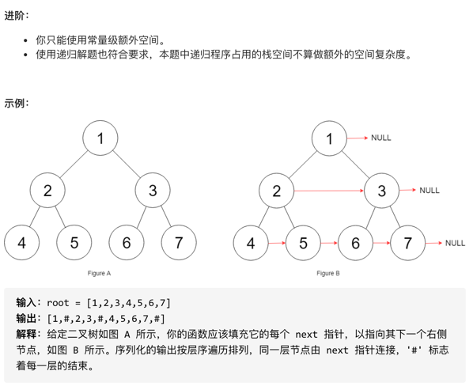
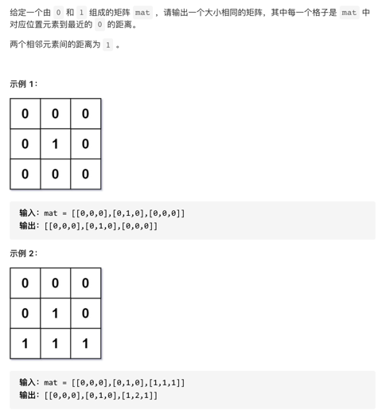
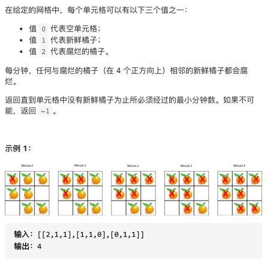

# 算法集合
## 二分查找
> 二分查找是一种基于比较目标值和数组中间元素的教科书式算法。
- 如果目标值等于中间元素，则找到目标值。
- 如果目标值较小，继续在左侧搜索。
- 如果目标值较大，则继续在右侧搜索。
### 搜索插入位置
```javascript
/**
* @param {number[]} nums
* @param {number} target
* @return {number}
  */
  var search = function(nums, target) {

  var start = 0
  var end = nums.length - 1
  while(start > end){
  var center_idx = (end - start) / 2 + start
  if(target == nums[center_idx]){
  return center_idx
  }else if(target > nums[center_idx]){
  start = center_idx + 1
  }else{
  end = center_idx - 1
  }
  }
  return -1
};
```


### 设计哈希集合
> 为了实现哈希集合这一数据结构，有以下几个关键问题需要解决：
> - 哈希函数：能够将集合中任意可能的元素映射到一个固定范围的整数值，并将该元素存储到整数值对应的地址上。
> - 冲突处理：由于不同元素可能映射到相同的整数值，因此需要在整数值出现「冲突」时，需要进行冲突处理。以下的解决策略是链地址法：为每个哈希值维护一个链表，并将具有相同哈希值的元素都放入这一链表当中。
```javascript
var MyHashSet = function() {
this.BASE = 769
this.arr = new Array(this.BASE).fill(0).map(()=>new Array())//数组嵌套空数组
};

MyHashSet.prototype.hash = function(key){
return key % this.BASE
}

/**
* @param {number} key
* @return {void}
  */
  MyHashSet.prototype.add = function(key) {
  const h = this.hash(key)
  for(const element of this.arr[h]){
  if(element == key){
  return
  }
  }
  this.arr[h].push(key)
  };

/**
* @param {number} key
* @return {void}
  */
  MyHashSet.prototype.remove = function(key) {
  const h = this.hash(key)
  for(const i in this.arr[h]){
  if(this.arr[h][i] == key){
  this.arr[h].splice(i,1)
  }
  }
  };

/**
* Returns true if this set contains the specified element
* @param {number} key
* @return {boolean}
  */
  MyHashSet.prototype.contains = function(key) {
  const h = this.hash(key)
  for(const element of this.arr[h]){
  if(element == key){
  return true
  }
  }
  return false
  };
```


## 双指针
### 有序数组的平方
> 给你一个按 非递减顺序 排序的整数数组 nums，返回每个数字的平方组成的新数组，要求也按非递减顺序排序。
- 输入：nums = [-4,-1,0,3,10]
- 输出：[0,1,9,16,100]
- 解释：平方后，数组变为 [16,1,0,9,100]
- 排序后，数组变为 [0,1,9,16,100]
```javascript
/**
* @param {number[]} nums
* @return {number[]}
  */
  var sortedSquares = function(nums) {
  var negIdx = 0
  //1、找到边界
  for(idx in nums){
  if(nums[idx]<0){
  negIdx = idx
  }else{
  break
  }
  }

  numLength = nums.length
  posIdx = negIdx*1 + 1

  var newArr = []

  //2、从分界出开始比较，小的推进数组，然后自己的方向后移
  while(negIdx >= 0 && posIdx < numLength){
  sqrtN = Math.pow(nums[negIdx],2)
  sqrtP = Math.pow(nums[posIdx],2)
  if(sqrtN>sqrtP){
  newArr.push(sqrtP)
  posIdx += 1
  }else{
  newArr.push(sqrtN)
  negIdx -= 1
  }
  }

  //3、比较完后，将剩余数推进
  if(negIdx==-1){
  for(var x = posIdx ; x < numLength ; x ++){
  sqrtP = Math.pow(nums[x],2)
  newArr.push(sqrtP)
  }
  }else{
  for(var z = negIdx ; z >= 0  ; z --){
  sqrtN = Math.pow(nums[z],2)
  newArr.push(sqrtN)
  }
  }
  return newArr
};
```

### 旋转数组
> 给定一个数组，将数组中的元素向右移动 k 个位置，其中 k 是非负数。
- 输入: nums = [1,2,3,4,5,6,7], k = 3
- 输出: [5,6,7,1,2,3,4]
- 解释:
- 向右旋转 1 步: [7,1,2,3,4,5,6]
- 向右旋转 2 步: [6,7,1,2,3,4,5]
- 向右旋转 3 步: [5,6,7,1,2,3,4]
```javascript
/**
* @param {number[]} nums
* @param {number} k
* @return {void} Do not return anything, modify nums in-place instead.
  */
  var rotate = function(nums, k) {
  //更新次数为count==nums.length次才结束
  //如果轮回到最初开始的下标时，count还不=nums.length，则最初下标后移一位继续
  const numLength = nums.length
  var count = 0;
  var forntIdx = 0
  var currentIdx = k % numLength
  var forntNum = nums[forntIdx]
  var startIdx = forntIdx
  while(count != numLength){
  if(currentIdx == startIdx){//轮回完了，如果还没结束，那就向后移一位
  nums[currentIdx] = forntNum
  //双指针初始化，在最初位置的基础上后移一位
  startIdx += 1
  forntIdx = startIdx
  currentIdx = (forntIdx + k) % numLength
  forntNum = nums[forntIdx]
  }else{//否则就继续替换
  const currentNum = nums[currentIdx]
  nums[currentIdx] = forntNum
  forntNum = currentNum
  //双指针循环位移k
  forntIdx = currentIdx
  currentIdx = (currentIdx + k) % numLength
  }
  count += 1
  }
  }
```

### 移动零
```javascript
/**
* @param {number[]} nums
* @return {void} Do not return anything, modify nums in-place instead.
  */
  var moveZeroes = function(neums) {
  var offset = 0 //左移偏移量
  var count = 0
  var numLength = nums.length
  var zeroArr = []//临时存储0数组 指针一
  while(count < numLength){
  if(nums[count]==0){
  zeroArr.push(nums[count])
  offset += 1
  }else{
  nums[count-offset] = nums[count]//多少个0，那么后面的非0数就要向前位移多少位 指针二
  }
  count += 1
  }
  //0塞回去
  for(var i = 0 ; i < zeroArr.length;i++){
  nums[numLength - offset] = zeroArr[i]
  offset -= 1
  }
  };
  ```
  
### 两数之和 II - 输入有序数组
  > 给定一个已按照 升序排列  的整数数组 numbers ，请你从数组中找出两个数满足相加之和等于目标数 target 。
  - 输入：numbers = [2,7,11,15], target = 9
  - 输出：[1,2]
  - 解释：2 与 7 之和等于目标数 9 。因此 index1 = 1, index2 = 2 。
```javascript
  /**
* @param {number[]} numbers
* @param {number} target
* @return {number[]}
  */
  var twoSum = function(numbers, target) {
  var leftIdx = 0
  var rightIdx = numbers.length - 1
  while((numbers[leftIdx]+numbers[rightIdx]) != target){
  const add = numbers[leftIdx]+numbers[rightIdx]
  if(add > target){
  rightIdx -= 1
  }else if(add < target){
  leftIdx += 1
  }
  }
  return [leftIdx+1,rightIdx+1]
  };
```


### 反转字符串
- 输入：["h","e","l","l","o"]
- 输出：["o","l","l","e","h"]
```javascript
/**
* @param {character[]} s
* @return {void} Do not return anything, modify s in-place instead.
  */
  var reverseString = function(s) {
  var leftIdx = 0
  var rightIdx = s.length - 1
  while(leftIdx<=rightIdx){
  const temp = s[leftIdx]
  s[leftIdx] = s[rightIdx]
  s[rightIdx] = temp
  leftIdx++
  rightIdx--
  }
  };
```

### 链表的中间结点
  - 输入：[1,2,3,4,5] 
  - 输出：此列表中的结点 3 (序列化形式：[3,4,5])
#### 单指针法
  ```javascript
  /**
* Definition for singly-linked list.
* function ListNode(val, next) {
*     this.val = (val===undefined ? 0 : val)
*     this.next = (next===undefined ? null : next)
* }
  */
  /**
* 单指针
* @param {ListNode} head
* @return {ListNode}
  */
  var middleNode = function(head) {
  var count = 0
  var currentNode = head
  while(currentNode != null){
  currentNode = currentNode.next
  count++
  }

  var middle = Math.floor(count/2)
  var middleListNode = head
  while(middle){
  middleListNode = middleListNode.next
  middle--
  }
  return middleListNode
  };
```


#### 快慢指针法
```javascript
/**
* Definition for singly-linked list.
* function ListNode(val, next) {
*     this.val = (val===undefined ? 0 : val)
*     this.next = (next===undefined ? null : next)
* }
  */
  /**
* @param {ListNode} head
* @return {ListNode}
  */
  var middleNode = function(head) {
  var slowNode = head
  var fastNode = head
  while(fastNode && fastNode.next){
  fastNode = fastNode.next.next
  slowNode = slowNode.next
  }
  return slowNode
  };
```


### 删除链表的倒数第 N 个结点
```javascript
/**
* Definition for singly-linked list.
* function ListNode(val, next) {
*     this.val = (val===undefined ? 0 : val)
*     this.next = (next===undefined ? null : next)
* }
  */
  /**
* @param {ListNode} head
* @param {number} n
* @return {ListNode}
  */
  var removeNthFromEnd = function(head, n) {
  //前驱节点
  var dumpNode = new ListNode(0,head)

  //慢指针
  var slowNode = dumpNode
  //快指针
  var fastNode = head

  var count = 0

  while(count<n){
  fastNode = fastNode.next
  count++
  }

  while(fastNode){
  fastNode = fastNode.next
  slowNode = slowNode.next
  }

  slowNode.next = slowNode.next.next

  return dumpNode.next

};
```

## 滑动窗口
### 无重复字符的最长子串
- 输入: s = "abcabcbb"
- 输出: 3  
- 解释: 因为无重复字符的最长子串是 "abc"，所以其长度为 3。
```javascript
/**
* @param {string} s
* @return {number}
  */
  var lengthOfLongestSubstring = function(s) {
  var mySet = new Set()
  var count = 0
  var maxLength = 0
  var startIdx = 0
  //遍历字符串
  while(count < s.length){
  //如果集合中存在该字符，则删除最左边字符，直到没有重复
  while(mySet.has(s[count])){
  mySet.delete(s[startIdx])
  startIdx++
  }
  //没有重复字符，则往集合中加入字符
  mySet.add(s[count])
  //更新最大长度
  if(maxLength < mySet.size){
  maxLength = mySet.size
  }
  count++
  }
  return maxLength
  };
```

### 字符串的排列
  - 输入：s1 = "abc" s2 = "eidbcaooo"
  - 输出：true
  - 解释：s2 包含 s1 的排列之一 ("bca").
```javascript
  /**
* @param {string} s1
* @param {string} s2
* @return {boolean}
  */
  var checkInclusion = function(s1, s2) {

  var s1Length = s1.length
  var s2Length = s2.length

  //26个字母，每个字母出现的次数
  var s1Cnt = new Array(26).fill(0)
  var s2Cnt = new Array(26).fill(0)

  //如果s1长度大于s2，则不包含
  if(s1Length > s2Length){
  return false
  }

  let aCode = 'a'.charCodeAt(0)
  //先存入s1的各个字符数量数组，顺便存s2的
  for(let i = 0; i < s1Length;i++){
  s1Cnt[s1.charCodeAt(i)-aCode] += 1
  s2Cnt[s2.charCodeAt(i)-aCode] += 1
  }

  if(s1Cnt.toString() === s2Cnt.toString()){
  return true
  }

  //滑窗遍历
  for(let i = s1Length ;i<s2Length;i++){
  s2Cnt[s2.charCodeAt(i)-aCode] += 1
  s2Cnt[s2.charCodeAt(i-s1Length)-aCode] -= 1

       if(s2Cnt.toString()===s1Cnt.toString()){
           return true
       }
  }

  return false


};
```

## 广度优先搜索/深度优先搜索
### 图形渲染
> 有一幅以二维整数数组表示的图画，每一个整数表示该图画的像素值大小，数值在 0 到 65535 之间。给你一个坐标 (sr, sc) 表示图像渲染开始的像素值（行 ，列）和一个新的颜色值 newColor，让你重新上色这幅图像。为了完成上色工作，从初始坐标开始，记录初始坐标的上下左右四个方向上像素值与初始坐标相同的相连像素点，接着再记录这四个方向上符合条件的像素点与他们对应四个方向上像素值与初始坐标相同的相连像素点，……，重复该过程。将所有有记录的像素点的颜色值改为新的颜色值。最后返回经过上色渲染后的图像。
- 输入:
- image = [[1,1,1],[1,1,0],[1,0,1]]
- sr = 1, sc = 1, newColor = 2
- 输出: [[2,2,2],[2,2,0],[2,0,1]]
- 解析:
- 在图像的正中间，(坐标(sr,sc)=(1,1)),
- 在路径上所有符合条件的像素点的颜色都被更改成2。
- 注意，右下角的像素没有更改为2，
- 因为它不是在上下左右四个方向上与初始点相连的像素点。

#### 深度优先搜索实现
```js
/**
* 深度优先搜索
* @param {number[][]} image
* @param {number} sr
* @param {number} sc
* @param {number} newColor
* @return {number[][]}
  */
  var floodFill = function(image, sr, sc, newColor) {
  var rowLength = image.length,columLength = image[0].length
  //记录原始值
  var orginColor = image[sr][sc]
  //如果原始值与新值一样，则不用作处理
  if(orginColor == newColor){
  return image
  }

  //每次判断当前值是否为原始值，如果为则替换成新值
  //然后进行数组上下左右的值的递归
  function dfs(row,colum){
  if(image[row][colum]==orginColor){
  image[row][colum] = newColor

           if((row-1)>=0){
               dfs(row-1,colum)
           }

           if((colum-1)>=0){
               dfs(row,colum-1)
           }


           if((row+1)<rowLength){
               dfs(row+1,colum)
           }

           if((colum+1)<columLength){
               dfs(row,colum+1)
           }

       }
  }

  dfs(sr,sc)

  return image
  };
```

#### 广度优先搜索实现
```javascript
  /**
* 广度优先搜索
* @param {number[][]} image
* @param {number} sr
* @param {number} sc
* @param {number} newColor
* @return {number[][]}
  */
  var floodFill = function(image, sr, sc, newColor) {
  var rowLength = image.length,columLength = image[0].length
  //记录原始值
  var orginColor = image[sr][sc]
  //如果原始值与新值一样，则不用作处理
  if(orginColor == newColor){
  return image
  }

  var arr = new Array(1).fill([sr,sc])
  let dx = [0,1,0,-1]//水平方向上右下左坐标
  let dy = [-1,0,1,0]//垂直方向上右下左坐标

  while(arr.length > 0){
  let [row,colum] = arr[0]
  image[row][colum] = newColor
  arr.shift(0)
  //4个方向都遍历，如果有和原始值一致的值，将其下标存入队列
  for(var i=0;i<4;i++){
  let rowOffset = row + dy[i],columOffset = colum + dx[i]
  if(rowOffset>=0 && rowOffset<rowLength && columOffset>=0 && columOffset < columLength){
  if(image[rowOffset][columOffset]==orginColor){
  arr.push([rowOffset,columOffset])
  }
  }
  }
  }
  return image
  };
```

### 岛屿的最大面积
#### 深度优先搜索
```javascript
/**
* @param {number[][]} grid
* @return {number}
  */
  var maxAreaOfIsland = function(grid) {
  let rowLength = grid.length , columLength = grid[0].length
  let dx = [0,1,0,-1]//水平方向上右下左坐标
  let dy = [-1,0,1,0]//垂直方向上右下左坐标

  var maxLength = 0

  function dsf(row,colum){
  if(grid[row][colum]==1){
  var sum = 1
  grid[row][colum] = 0
  //4个方向都遍历，如果有和原始值一致的值，继续，否则回溯
  for(let i=0;i<4;i++){
  let rowOffset = row + dy[i],columOffset = colum + dx[i]
  if(rowOffset>=0 && rowOffset<rowLength && columOffset>=0 && columOffset < columLength){
  sum += dsf(rowOffset,columOffset)
  }
  }
  return sum
  }else{
  return 0
  }
  }

  for(var i = 0 ; i < rowLength ; i ++){
  for(var j = 0 ; j < columLength;j++){
  if(grid[i][j]==1){
  maxLength = Math.max(maxLength,dsf(i,j))
  }

       }
  }

  return maxLength
  };
```

### 填充每个节点的下一个右侧节点指针
> 给定一个 完美二叉树 ，其所有叶子节点都在同一层，每个父节点都有两个子节点。
- 填充它的每个 next 指针，让这个指针指向其下一个右侧节点。如果找不到下一个右侧节点，则将 next 指针设置为 NULL。


#### 深度优先搜索
```javascript
/**
 * // Definition for a Node.
 * function Node(val, left, right, next) {
 *    this.val = val === undefined ? null : val;
 *    this.left = left === undefined ? null : left;
 *    this.right = right === undefined ? null : right;
 *    this.next = next === undefined ? null : next;
 * };
 */

/**
 * @param {Node} root
 * @return {Node}
 */
var connect = function(root) {
    if(root===null){
        return root
    }

    function dfs(node){
        if(node.left && node.right){
            node.left.next = node.right
            if(node.next){
                node.right.next = node.next.left
            }
        }

        if(node.left){
            dfs(node.left)
        }
        if(node.right){
            dfs(node.right)
        }

    }

    dfs(root)

    return root

};
```

### 合并二叉树
```
输入: 
	Tree 1                     Tree 2                  
          1                         2                             
         / \                       / \                            
        3   2                     1   3                        
       /                           \   \                      
      5                             4   7                  
输出: 
合并后的树:
	     3
	    / \
	   4   5
	  / \   \ 
	 5   4   7
```
#### 深度优先搜索算法，递归
```javascript
/**
 * Definition for a binary tree node.
 * function TreeNode(val, left, right) {
 *     this.val = (val===undefined ? 0 : val)
 *     this.left = (left===undefined ? null : left)
 *     this.right = (right===undefined ? null : right)
 * }
 */
/**
 * @param {TreeNode} root1
 * @param {TreeNode} root2
 * @return {TreeNode}
 */
var mergeTrees = function(root1, root2) {
    if(!root1){
        return root2
    }
    if(!root2){
        return root1
    }
    //定义根节点
    var newTree = new TreeNode(root1.val+root2.val)
    //递归
    newTree.left = mergeTrees(root1.left,root2.left)
    newTree.right = mergeTrees(root1.right,root2.right)
    return newTree
    
};
```

### 01矩阵 - 广度优先搜索

```javascript
/**
 * @param {number[][]} mat
 * @return {number[][]}
 */
var updateMatrix = function(mat) {

    let dr = [-1,0,1,0], dc = [0,1,0,-1]

    let rLength = mat.length,cLength = mat[0].length

    //遍历，将所有0的位置推进去
    var stack = [] //队列
    var record = new Set() //记录以计算完距离的数组
    for(let r = 0 ; r < rLength ; r++){
        for(let c = 0 ; c < cLength ; c++){
            if(!mat[r][c]){
                let arr = [r,c]
                stack.push([r,c])
                record.add(arr.toString())
            }
        }
    }

    while(stack.length){
        //取出队列一个数
        let [row,colum] = stack.shift(0)
        let nowValue = mat[row][colum]
        for(let i = 0 ; i < 4; i++){
            let r = row + dr[i] , c = colum + dc[i]
            let arr = [r,c]
            if(r >= 0 && r < rLength && c >= 0 && c < cLength && !record.has(arr.toString())){
                    mat[r][c] = nowValue + 1
                    stack.push([r,c])
                    record.add(arr.toString())    
            }
        }
    }
    return mat
};
```

### 腐烂的橘子 - 广度优先搜索

```javascript
/**
 * @param {number[][]} grid
 * @return {number}
 */
var orangesRotting = function(grid) {
    let dr = [-1,0,1,0],dc = [0,1,0,-1]
    let rowLength = grid.length,columLength = grid[0].length
    let freshCount = 0
    let stack = []
    //先遍历一遍，将腐烂橘子位置加入数组，并计算新鲜橘子个数
    for(let i = 0 ; i < rowLength; i++){
        for(let j = 0 ; j < columLength; j++){
            if(grid[i][j]==1){
                freshCount += 1
            }
            if(grid[i][j]==2){
                stack.push([i,j])
            }
        }
    }

    //新鲜橘子数=0，则腐烂时间0
    if(!freshCount){
        return 0
    }

    //如果腐烂橘子数=0，新鲜橘子数存在，则腐烂时间无穷
    if(!stack.length&&freshCount){
        return -1
    }


    
    let overTime = 0
    let overCnt = 0
    while(stack.length){
        let stackLength = stack.length
        for(let j = 0 ; j < stackLength;j++){
            let [row,colum] = stack.shift()
            for(let i = 0 ; i < 4 ; i++){
                let r = row+dr[i],c = colum+dc[i]
                if(r>=0&&r<rowLength&&c>=0&&c<columLength){
                  if(grid[r][c]==1){
                    stack.push([r,c])
                    grid[r][c] = 2
                    overCnt += 1
                    }
                }
            }
        }

        if(stack.length){
            overTime += 1
        }

        
        
    }

    if (overCnt!= freshCount){
        return -1
    }

    return overTime


};
```


## 不交换中间变量交换两个数
```javascript
var num1 = 20, num2 = 30
num1 = num1 + num2 // 50
num2 = num1 - num2 // 50 - 30 = 20
num1 = num1 - num2 // 50 - 20 = 30
```


