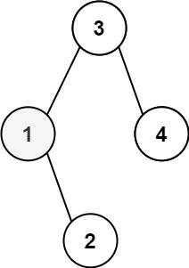
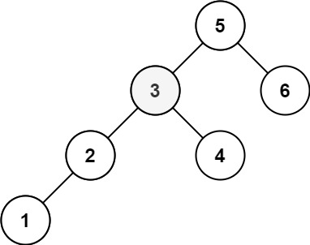

## 二叉搜索树中第K小的元素
> https://leetcode.cn/problems/kth-smallest-element-in-a-bst/description/?envType=study-plan-v2&envId=top-100-liked

```
给定一个二叉搜索树的根节点 root ，和一个整数 k ，请你设计一个算法查找其中第 k 小的元素（从 1 开始计数）。
```
 

示例 1：


> 输入：root = [3,1,4,null,2], k = 1
输出：1
示例 2：


> 输入：root = [5,3,6,2,4,null,null,1], k = 3
输出：3

```javascript
/**
 * Definition for a binary tree node.
 * function TreeNode(val, left, right) {
 *     this.val = (val===undefined ? 0 : val)
 *     this.left = (left===undefined ? null : left)
 *     this.right = (right===undefined ? null : right)
 * }
 */
/**
 * @param {TreeNode} root
 * @param {number} k
 * @return {number}
 */
var kthSmallest = function(root, k) {
    // 中序遍历（左根右）就是从小到大排序，排到第k个时停止
    let res
    function dfs(node) {
        if(!k) return
        if(!node) return
        node.left && dfs(node.left)
        k--
        if(!k) {
            res = node.val
            return
        }
        node.right && dfs(node.right)        
    }
    dfs(root)
    return res
};
```