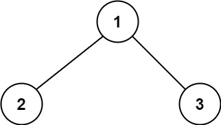
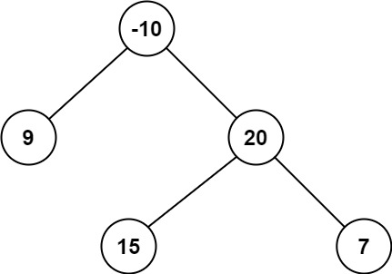

## 二叉树中的最大路径和
> https://leetcode.cn/problems/binary-tree-maximum-path-sum/description/?envType=study-plan-v2&envId=top-100-liked

```
二叉树中的 路径 被定义为一条节点序列，序列中每对相邻节点之间都存在一条边。同一个节点在一条路径序列中 至多出现一次 。该路径 至少包含一个 节点，且不一定经过根节点。

路径和 是路径中各节点值的总和。

给你一个二叉树的根节点 root ，返回其 最大路径和 。
```

示例 1:

> 输入：root = [1,2,3]
输出：6
解释：最优路径是 2 -> 1 -> 3 ，路径和为 2 + 1 + 3 = 6

示例 2:

> 输入：root = [-10,9,20,null,null,15,7]
输出：42
解释：最优路径是 15 -> 20 -> 7 ，路径和为 15 + 20 + 7 = 42


```javascript
/**
 * Definition for a binary tree node.
 * function TreeNode(val, left, right) {
 *     this.val = (val===undefined ? 0 : val)
 *     this.left = (left===undefined ? null : left)
 *     this.right = (right===undefined ? null : right)
 * }
 */
/**
 * @param {TreeNode} root
 * @return {number}
 */
var maxPathSum = function(root) {
    // 1. 遍历结果，分2种情况
    // 1.1. 当前节点最大贡献值 = 当前节点值 + 左子树最大贡献值（非负） + 右子树最大贡献值（非负）
    // 2. 递归条件
    // 2.1 叶子节点：非负数时作为最大贡献值返回，否则最大贡献值为0
    // 2.2 非叶子节点:  当前节点值 + 取其中的最大值（左子树最大贡献值,右子树最大贡献值）


    // ps: 获取节点最大贡献值，和递归的最大贡献值，逻辑不一样。
    // 获取当前节点最大贡献值，相当于以当前节点作为根节点了，最大贡献值就是当前节点加左子树和右子树的最大贡献值
    // 而当往回递归时，只能选择其一，否则就存在分叉了
    let max = -Number.MAX_VALUE // 递归过程更新最大值

    function dfs(node) {
        if(!node) return 0
        const val = node.val

        const leftMax = dfs(node.left)
        const rightMax = dfs(node.right)
        
        // 1. 当前节点最大贡献值 = 当前节点值 + 左子树最大贡献值 + 右子树最大贡献值
        const sum = val + Math.max(leftMax, 0) + Math.max(rightMax, 0) 

        max = Math.max(max, sum) // 更新最大值
        
        if(!node.left && !node.right) {
            // 2.1. 叶子节点：非负数时作为最大贡献值返回，否则最大贡献值为0
            return Math.max(val, 0)
        } else {
            // 2.2 非叶子节点:  当前节点值 + 取其中的最大值（左子树最大贡献值,右子树最大贡献值）
            const childMax = Math.max(leftMax, rightMax)
            return Math.max(val + childMax, 0) // 大于0才选为最大贡献值递归，否则不选相当于0
        }

    }
    dfs(root)
    return max
};
```