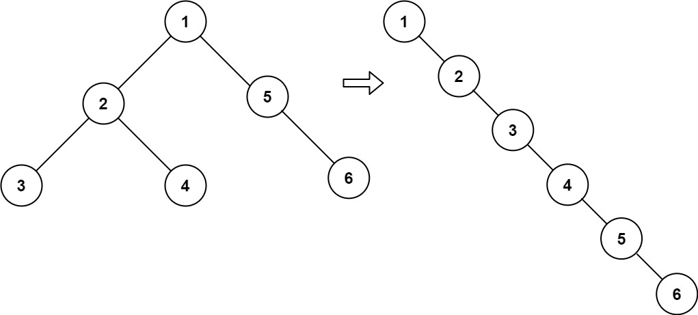

## 二叉树展开为链表
> https://leetcode.cn/problems/kth-smallest-element-in-a-bst/description/?envType=study-plan-v2&envId=top-100-liked

```
给你二叉树的根结点 root ，请你将它展开为一个单链表：

展开后的单链表应该同样使用 TreeNode ，其中 right 子指针指向链表中下一个结点，而左子指针始终为 null 。
展开后的单链表应该与二叉树 先序遍历 顺序相同。
```
 

示例 1：

> 输入：root = [1,2,5,3,4,null,6]
输出：[1,null,2,null,3,null,4,null,5,null,6]

```javascript
/**
 * Definition for a binary tree node.
 * function TreeNode(val, left, right) {
 *     this.val = (val===undefined ? 0 : val)
 *     this.left = (left===undefined ? null : left)
 *     this.right = (right===undefined ? null : right)
 * }
 */
/**
 * @param {TreeNode} root
 * @return {void} Do not return anything, modify root in-place instead.
 */
var flatten = function(root) {

    // 1.右节点，放到左节点的最右边叶子节点上
    // 2.左节点覆盖到右节点
    function dfs(node) {
        if(!node) return
        if(node.left) {
            const leftTail = treeRightTail(node.left) // 获取左节点的最右边叶子节点上
            leftTail.right = node.right // 最右边叶子节点的右子树挂载上原本的右节点
            node.right = node.left // 左节点覆盖到右节点
            node.left = null // 删除左子树
        }
        dfs(node.right)
    }
    dfs(root)
};


function treeRightTail(node) {
    while(node.right) {
        node = node.right
    }
    return node
}
```