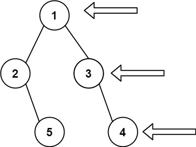

## 二叉树的右视图
> https://leetcode.cn/problems/binary-tree-right-side-view/description/?envType=study-plan-v2&envId=top-100-liked

```
给定一个二叉树的 根节点 `root`，想象自己站在它的右侧，按照从顶部到底部的顺序，返回从右侧所能看到的节点值。
```

示例 1:

> 输入: [1,2,3,null,5,null,4]
输出: [1,3,4]

示例 2:
> 输入: [1,null,3]
输出: [1,3]

示例 3:
> 输入: []
输出: []

```javascript
/**
 * Definition for a binary tree node.
 * function TreeNode(val, left, right) {
 *     this.val = (val===undefined ? 0 : val)
 *     this.left = (left===undefined ? null : left)
 *     this.right = (right===undefined ? null : right)
 * }
 */
/**
 * @param {TreeNode} root
 * @return {number[]}
 */
var rightSideView = function(root) {
    if(!root) return []
    // 用队列来记录，数组记录[深度,节点]
    const queue = [[0, root]] // 初始化深度为0的root节点
    const res = []
    while(queue.length) {
        const [deep, node] = queue.shift()
        // 按照先左树后右树的方式，最终遍历到当前deep的最右边的节点值会覆盖
        res[deep] = node.val
        // 先左树后右树
        node.left && queue.push([deep+1, node.left])
        node.right && queue.push([deep+1, node.right])
    }
    return res
};
```