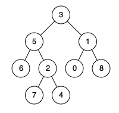

## 二叉树的最近公共祖先
> https://leetcode.cn/problems/lowest-common-ancestor-of-a-binary-tree/description/?envType=study-plan-v2&envId=top-100-liked

```
给定一个二叉树, 找到该树中两个指定节点的最近公共祖先。

百度百科中最近公共祖先的定义为：“对于有根树 T 的两个节点 p、q，最近公共祖先表示为一个节点 x，满足 x 是 p、q 的祖先且 x 的深度尽可能大（一个节点也可以是它自己的祖先）。”
```

示例 1:

> 输入：root = [3,5,1,6,2,0,8,null,null,7,4], p = 5, q = 1
输出：3
解释：节点 5 和节点 1 的最近公共祖先是节点 3 。

示例 2:

> 输入：root = [3,5,1,6,2,0,8,null,null,7,4], p = 5, q = 4
输出：5
解释：节点 5 和节点 4 的最近公共祖先是节点 5 。因为根据定义最近公共祖先节点可以为节点本身。

示例 3:
> 输入：root = [1,2], p = 1, q = 2
输出：1


```javascript
/**
 * Definition for a binary tree node.
 * function TreeNode(val) {
 *     this.val = val;
 *     this.left = this.right = null;
 * }
 */
/**
 * @param {TreeNode} root
 * @param {TreeNode} p
 * @param {TreeNode} q
 * @return {TreeNode}
 */
var lowestCommonAncestor = function(root, p, q) {
    // dfs 中序遍历 
    // 如果遇到p或q时，首先遇到的，开始假设当前节点为祖先节点，如果要递归了，还没找到另外一个节点，则回退祖先节点为当前假设祖先节点的父节点

    let res;
    function dfs(node) {
        if(res || !node) return 0

        let val = 0

        // 当前节点为p或q，记录val为1
        if(node == p || node == q) {
            val = 1
        }
        // 遍历左节点
        const left_val = dfs(node.left)
        // 遍历右节点
        const right_val = dfs(node.right)
        // 如果遍历左节点或右节点遇到p或q节点时，left_val或right_val为1
        val = val + left_val + right_val // 当val为2时，说明p和q节点都遇到了，此时首次遇到val为2的节点即未公共祖先节点
        if(val === 2 && !res) { // res只赋值一次，首次赋值的即为最近公共祖先节点
            res = node
        }
        // 返回val，1则遇到，0则没遇到
        return val
    }
    dfs(root)
    return res;
};
```