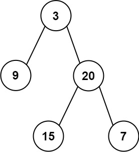

## 从前序与中序遍历序列构造二叉树
> https://leetcode.cn/problems/construct-binary-tree-from-preorder-and-inorder-traversal/description/?envType=study-plan-v2&envId=top-100-liked

```
给定两个整数数组 preorder 和 inorder ，其中 preorder 是二叉树的先序遍历， inorder 是同一棵树的中序遍历，请构造二叉树并返回其根节点。
```

示例 1:

> 输入: preorder = [3,9,20,15,7], inorder = [9,3,15,20,7]
输出: [3,9,20,null,null,15,7]

示例 2:
> 输入: preorder = [-1], inorder = [-1]
输出: [-1]


```javascript
/** 
 * Definition for a binary tree node.
 * function TreeNode(val, left, right) {
 *     this.val = (val===undefined ? 0 : val)
 *     this.left = (left===undefined ? null : left)
 *     this.right = (right===undefined ? null : right)
 * }
 */
/**
 * @param {number[]} preorder
 * @param {number[]} inorder
 * @return {TreeNode}
 */
 
var buildTree = function(preorder, inorder) {
    // preorder 先序遍历  根左右
    // inorder 中序遍历 左根右

    // preorder第一项是根节点
    // 取preorder的第一项即根节点，在inorder中找到根节点位置mid，那么[0, mid-1]这个区间就是inorder的[左子树]部分,[1, mid]是preorder的[左子树]部分
    // 此时就可以划分出preorder的左、右子树，inorder的左右子树，继续递归

    // 超时了
    // if(!preorder.length) return null
    // const rootVal = preorder[0]
    // const root = new TreeNode(rootVal)
    // const mid = inorder.indexOf(rootVal)
    // root.left = buildTree(preorder.slice(1, mid+1), inorder.slice(0, mid))
    // root.right = buildTree(preorder.slice(mid+1), inorder.slice(mid))

    // 改用指针
    function iterator(preStart, preEnd, inStart, inEnd) {
        if(preStart>preEnd) return null;
        const rootVal = preorder[preStart]
        const root = new TreeNode(rootVal)
        const mid = inorder.indexOf(rootVal)
        const leftSum = mid - inStart // 左子树节点数
        root.left = iterator(preStart + 1, preStart + leftSum, inStart, mid -1)
        root.right = iterator(preStart + leftSum + 1, preEnd, mid + 1, inEnd)
        return root
    }
    
    const len = preorder.length - 1
    return iterator(0, len, 0, len)
};
```