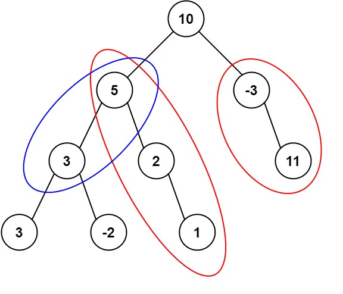

## 路径总和 III
> https://leetcode.cn/problems/path-sum-iii/description/?envType=study-plan-v2&envId=top-100-liked

```
给定一个二叉树的根节点 root ，和一个整数 targetSum ，求该二叉树里节点值之和等于 targetSum 的 路径 的数目。

路径 不需要从根节点开始，也不需要在叶子节点结束，但是路径方向必须是向下的（只能从父节点到子节点）。
```

示例 1:

> 输入：root = [10,5,-3,3,2,null,11,3,-2,null,1], targetSum = 8
输出：3
解释：和等于 8 的路径有 3 条，如图所示。

示例 2:
> 输入：root = [5,4,8,11,null,13,4,7,2,null,null,5,1], targetSum = 22
输出：3


```javascript
/**
 * Definition for a binary tree node.
 * function TreeNode(val, left, right) {
 *     this.val = (val===undefined ? 0 : val)
 *     this.left = (left===undefined ? null : left)
 *     this.right = (right===undefined ? null : right)
 * }
 */
/**
 * @param {TreeNode} root
 * @param {number} targetSum
 * @return {number}
 */
var pathSum = function(root, targetSum) {
    // 先序遍历+前缀和
    // 先序遍历：根左右，遍历顺序符合【路径方向必须是向下】
    // 前缀和：记录当前遍历所有节点的前缀和出现次数
    let res = 0
    const preSumMap = {0: 1} // {和:出现次数} 初始化和为0出现次数为1
    function dfs(node, sum) {
        if(!node) return

        // 前缀和
        sum = sum + node.val

        // 判断在前缀和中，是否存在【当前和】与【目标值】差值为前缀和的情况
        if(preSumMap[sum - targetSum]) {
            res += preSumMap[sum - targetSum] // 存在，则取这个前缀和的出现次数
        } 
        // 收集前缀和
        preSumMap[sum] = (preSumMap[sum] ?? 0) + 1
        
        dfs(node.left, sum)
        dfs(node.right, sum)

        // 节点递归时，删除当前节点的前缀和
        preSumMap[sum] = (preSumMap[sum] ?? 0) - 1
    }

    dfs(root, 0)
    return res
};
```