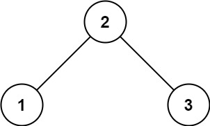

## 二验证二叉搜索树
> https://leetcode.cn/problems/validate-binary-search-tree/description/?envType=study-plan-v2&envId=top-100-liked

```
给你一个二叉树的根节点 root ，判断其是否是一个有效的二叉搜索树。

有效 二叉搜索树定义如下：

节点的左子树 只包含 小于 当前节点的数。
节点的右子树 只包含 大于 当前节点的数。
所有左子树和右子树自身必须也是二叉搜索树。
```

示例 1:

> 输入：root = [2,1,3]
输出：true

示例 2:

> 输入：root = [5,1,4,null,null,3,6]
输出：false
解释：根节点的值是 5 ，但是右子节点的值是 4 。


```javascript
/**
 * Definition for a binary tree node.
 * function TreeNode(val, left, right) {
 *     this.val = (val===undefined ? 0 : val)
 *     this.left = (left===undefined ? null : left)
 *     this.right = (right===undefined ? null : right)
 * }
 */
/**
 * @param {TreeNode} root
 * @return {boolean}
 */
var isValidBST = function(root) {
    return check(root, -Infinity, Infinity)
};

function check(root, lower, upper) {
    if(!root) return true
    const val = root.val
    if(val <= lower || val >= upper) return false
    return check(root.left, lower, val) && check(root.right, val, upper)
}
```