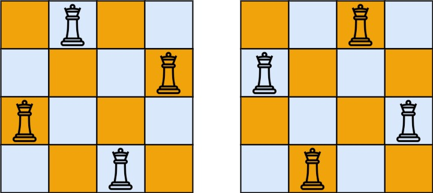

# N 皇后
> [力扣原题](https://leetcode.cn/problems/n-queens/description/?envType=study-plan-v2&envId=top-100-liked)

按照国际象棋的规则，皇后可以攻击与之处在同一行或同一列或同一斜线上的棋子。

n 皇后问题 研究的是如何将 `n` 个皇后放置在 `n×n` 的棋盘上，并且使皇后彼此之间不能相互攻击。

给你一个整数 `n` ，返回所有不同的 `n` 皇后问题 的解决方案。

每一种解法包含一个不同的 `n` 皇后问题 的棋子放置方案，该方案中 `'Q'` 和 `'.'` 分别代表了皇后和空位。


示例 1：

> 输入：`n = 4`
输出：`[[".Q..","...Q","Q...","..Q."],["..Q.","Q...","...Q",".Q.."]]`
解释：如上图所示，4 皇后问题存在两个不同的解法。

示例 2：
> 输入：`n = 1`
输出：`[["Q"]]`


```javascript
/**
 * @param {number} n
 * @return {string[][]}
 */
var solveNQueens = function(n) {
 // 向左斜线 行下标与列下标差值相同
 // 向右斜线 行下标与列下标之和相同
 // n行n列的网格，斜行有n*2-1条

 const res = []
 const record = Array(n).fill(0); // 记录Q某一行下标的列下标

 const col = Array(n).fill(false); // 记录列是否已经放Q
 const slash_left = Array(n * 2 - 1).fill(false); // 记录向左斜线是否已经放Q
 const slash_right = Array(n * 2 - 1).fill(false); // 记录向右斜线是否已经放Q

 function dfs(r) {
    if(r === n) { // 记录一种解法
        res.push(record.map((c)=> '.'.repeat(c) + 'Q' + '.'.repeat(n - c - 1)))
        return
    }

    for(let c = 0; c < n; c++) {
        if(!col[c] && !slash_left[r-c] && !slash_right[r+c]) {
            // 如果当前列、向左斜线、向右斜线都被Q影响
            // 则记录当前行的列下标
            record[r] = c;
            // 设置为被影响
            col[c] = slash_left[r-c] = slash_right[r+c] = true; 
             // 遍历下一行
            dfs(r+1);
            // 恢复
            col[c] = slash_left[r-c] = slash_right[r+c] = false; 
        }
    }
 }

 dfs(0)
 return res
};
```

# 解题思路
1. 使用深度遍历`dfs`。
2. `向左斜线` => `行下标与列下标差值相同`。`向右斜线` => `行下标与列下标之和相同`。
3. `n行n列`的网格，斜行有`n*2-1`条。
4. 一列只能放一个`Q`，一行只能放一个`Q`。
5. 用`col`、`slash_left`、`slash_right`三个集合，分别记录`列`、`左斜线上`、`右斜线上`是否有Q。
6. 综上，只需要遍历每一列，每次放`Q`时，对于每个位置判断其是否在三个集合中，如果三个集合都不包含当前位置，则当前位置是可以放`Q`。
7. 如果可以放`Q`，则记录`列`、`左斜线上`、`右斜线上`相应下标为 `true`的有`Q`状态，继续遍历下一行，如果可以遍历完所有行则获得一种解法。
