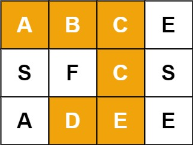
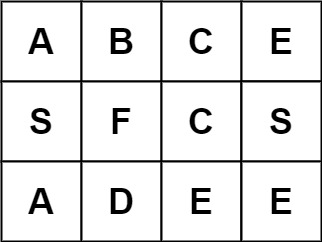

# 单词搜索
> [力扣原题](https://leetcode.cn/problems/word-search/description/?envType=study-plan-v2&envId=top-100-liked)

给定一个 `m x n` 二维字符网格 board 和一个字符串单词 `word` 。如果 `word` 存在于网格中，返回 `true` ；否则，返回 `false` 。

单词必须按照字母顺序，通过相邻的单元格内的字母构成，其中“相邻”单元格是那些水平相邻或垂直相邻的单元格。同一个单元格内的字母不允许被重复使用


示例 1：


> 输入：`board = [["A","B","C","E"],["S","F","C","S"],["A","D","E","E"]], word = "ABCCED"`
输出：`true`

示例 2：

> 输入：`board = [["A","B","C","E"],["S","F","C","S"],["A","D","E","E"]], word = "SEE"`
输出：`true`

示例 3：

> 输入：`board = [["A","B","C","E"],["S","F","C","S"],["A","D","E","E"]], word = "ABCB"`
输出：`false`


```javascript
/**
 * @param {character[][]} board
 * @param {string} word
 * @return {boolean}
 */
var exist = function(board, word) {
    let res = false
    let visited = new Set()
    const m = board.length
    const n = board[0].length
    // i：当前访问横坐标 j：当前访问纵坐标 x：当前word中匹配字符的下标
    function dfs(i = 0, j = 0, x = 0) {
        if(res) return
        if(x === word.length) return res = true
        if(i < 0 || i >= m) return
        if(j < 0 || j >= n) return
        // 如果当前位置未访问过，且word[x]等于当前位置的值
        const val = board[i][j]
        if(!visited.has(`${i}-${j}`) && word[x] === val) {
            // 记录访问状态
            visited.add(`${i}-${j}`)
            // 访问下一个 上下左右方向 
            dfs(i-1, j, x + 1)
            dfs(i+1, j, x + 1)
            dfs(i, j-1, x + 1)
            dfs(i, j+1, x + 1)
            // 访问完后递归时删除访问记录
            visited.delete(`${i}-${j}`)
        }
    }

    for(let i = 0; i < m; i++) {
        for(let j = 0; j < n; j++) {
            dfs(i,j)
        }
    }
    
    return res
};

```

# 解题思路
1. 使用深度遍历`dfs`
2. 网格逐个位置开始遍历，word从下标`x=0`字符开始，如果判断`word`当前下标值等于网格位置的值，则记录当前已访问网格坐标，并从上下左右4个方向继续访问，并判断word的下一个字符。
