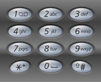

# 电话号码的字母组合
> [力扣原题](https://leetcode.cn/problems/letter-combinations-of-a-phone-number/description/?envType=study-plan-v2&envId=top-100-liked)

给定一个仅包含数字 `2-9` 的字符串，返回所有它能表示的字母组合。答案可以按 任意顺序 返回。

给出数字到字母的映射如下（与电话按键相同）。注意 1 不对应任何字母。



示例 1：

> 输入：`digits = "23"`
输出：`["ad","ae","af","bd","be","bf","cd","ce","cf"]`

示例 2：
> 输入：`digits = ""`
输出：`[]`

示例 3：
> 输入：`digits = "2"`
输出：`["a","b","c"]`


```javascript
/**
 * @param {string} digits
 * @return {string[]}
 */
var letterCombinations = function(digits) {
    const digitMap = {
        2: ['a', 'b', 'c'],
        3: ['d', 'e', 'f'],
        4: ['g', 'h', 'i'],
        5: ['j', 'k', 'l'],
        6: ['m', 'n', 'o'],
        7: ['p', 'q', 'r', 's'],
        8: ['t', 'u', 'v'],
        9: ['w', 'x', 'y', 'z'],
    }
    const res = []
    function dfs(i = 0, str = '') {
        if(i === digits.length) {
            return str && res.push(str)
        }

        const letters = digitMap[digits[i]]
        for(const letter of letters) {
            dfs(i+1, str+letter)
        }

    }
    dfs()
    return res;
};
```

# 解题思路
> 构建数组和字母的映射集合，使用深度遍历，从下标`i=0`的数字开始，查找到其所有映射的字母并拼接，继续传递给下标`i=i+1`的数字，直到`i=digits.length`结束，此时的拼接字符串为一种组合。
