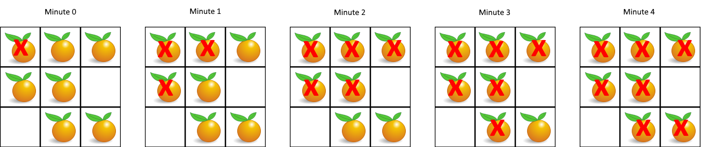

## 腐烂的橘子
> https://leetcode.cn/problems/rotting-oranges/description/?envType=study-plan-v2&envId=top-100-liked

在给定的 `m x n` 网格 `grid` 中，每个单元格可以有以下三个值之一：

值 `0` 代表空单元格；
值 `1` 代表新鲜橘子；
值 `2` 代表腐烂的橘子。
每分钟，腐烂的橘子 周围 4 个方向上相邻 的新鲜橘子都会腐烂。

返回 直到单元格中没有新鲜橘子为止所必须经过的最小分钟数。如果不可能，返回 `-1` 。

示例 1:

> 输入：grid = [[2,1,1],[1,1,0],[0,1,1]]
输出：4

示例 2:
> 输入：grid = [[2,1,1],[0,1,1],[1,0,1]]
输出：-1
解释：左下角的橘子（第 2 行， 第 0 列）永远不会腐烂，因为腐烂只会发生在 4 个方向上。

示例 3:
> 输入：grid = [[0,2]]
输出：0
解释：因为 0 分钟时已经没有新鲜橘子了，所以答案就是 0 。

```javascript
/**
 * @param {number[][]} grid
 * @return {number}
 */
var orangesRotting = function(grid) {


    const queue = [] // 腐烂橘子队列， 每一个个item定义为 [行, 列, 腐烂时间]

    const m = grid.length
    const n = grid[0].length

    let freshCount = 0;
    // 初始化，收集所有腐烂橘子，放入队列中 ，并记录健康橘子总数
    for(let i = 0; i < m; i++) {
        for(let j = 0; j < n; j++) {
            if(grid[i][j] === 2) {
                queue.push([i, j, 0]) // 定义 [行, 列, 腐烂时间]
            } else if(grid[i][j] === 1) {
                freshCount += 1
            }
        }
    }

    let minMinutes = 0

    while(queue.length) {
        const [row, col, minute] = queue.shift()
        // 当前腐烂上下左右未腐烂的橘子，设置为下一分钟腐烂
        if(row > 0 && grid[row-1][col] === 1) {
            grid[row-1][col] = 2 // 设置为腐烂，避免重复计算
            queue.push([row-1, col, minute + 1])
            minMinutes = minute + 1 // 更新腐烂最短时长
            freshCount -= 1 // 新鲜橘子数量-1
        }
        if(row < m - 1 && grid[row+1][col] === 1) {
            grid[row+1][col] = 2
            queue.push([row+1, col, minute + 1])
            minMinutes = minute + 1
            freshCount -= 1
        }
        if(col > 0 && grid[row][col-1] === 1) {
            grid[row][col-1] = 2
            queue.push([row, col-1, minute + 1])
            minMinutes = minute + 1
            freshCount -= 1
        }
         if(col < n - 1 && grid[row][col+1] === 1) {
            grid[row][col+1] = 2
            queue.push([row, col+1, minute + 1])
            minMinutes = minute + 1
            freshCount -= 1
        }
    }


    return freshCount ? -1 : minMinutes

};
```